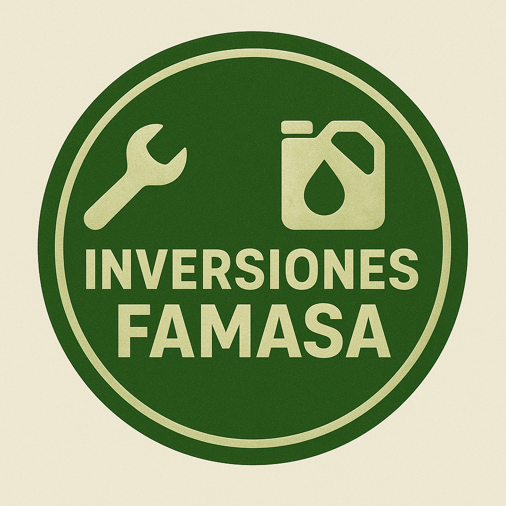

<a id="readme-top"></a>


[![LinkedIn][linkedin-shield]][linkedin-url]



**⚡ Sistema Gestor de Inventario** CMS desarrollado en Laravel (12) — Administra Usuarios, Roles, Permisos, Módulos, Configuraciones, Traducciones, Control de inventario: (Ventas, Inventario, Proveedores, Usuarios, Cajas, Tipos de monedas), registros del sistema, monitoreo y todas las acciones de tu aplicación Laravel. Es una solución CMS completa para negocios y empresas tipo comercio, integrada con Tailwind CSS y todas las funcionalidades iniciales: módulos, modo oscuro/luz, gráficos, tablas, formularios, numerosos componentes y mucho más. Con nuestros módulos premium puedes obtener funcionalidades adicionales como CRM, HRM, gestión de cursos, entre otros.

Este proyecto fue realizado para cumplir con una propuesta presentada a Inversiones Famasa C.A. y para completar los requisitos exigidos para optar al título de Licenciado en Computación en la Universidad del Zulia.

**Usuario demostración:**
```
Email - superadmin@example.com
password - 12345678
```

## 📋 Requerimientos:
- Spatie role permission package  `^6.4`
- PHPUnit test package `^11.x`
- Tailwind CSS >= 4.x
- Laravel Modules - https://laravelmodules.com/docs/12/getting-started/introduction
- Laravel Events (A WordPress like action/filter hooks) - https://github.com/tormjens/eventy


<p align="right"><a href="#readme-top">Volver arriba</a></p>

## 🚀 Configuración del Proyecto
**Clonar y ejecutar el proyecto**
```console
git clone git@github.com:KumbaC/gestion-inventario-famasa.git
cd gestion-inventario-famasa
```

**Instalar dependencias de Composer y Node**
```console
composer install
npm install
```

**Base de datos y creación de archivo env**
- Crea una base de datos llamada `inventario_famasa`
- Crea el archivo `.env` copiando el archivo `.env.example`

**Generar clave de Artisan y enlaces necesarios**
```console
php artisan key:generate
php artisan storage:link
```

**Migrar la base de datos con seeders**
```console
php artisan migrate:fresh --seed && php artisan module:seed
```

**Ejecutar el proyecto**
```php
php artisan serve
npm run dev
```

¡Listo! Ahora esta desplegado el proyecto en tu local - http://localhost:8000

<p align="right"><a href="#readme-top">Volver arriba</a></p>

## ⚙️ Cómo funciona

1. Inicia sesión usando las credenciales de Super Admin:
  1. Email: `superadmin@example.com`
  1. Contraseña: `12345678`
1. Olvidé mi contraseña: la función de recuperación y restablecimiento de contraseña funcionará si el correo está configurado correctamente.
1. Crear usuario
1. Crear rol
1. Asignar permisos a los roles
1. Asignar múltiples roles a un usuario
1. Verifica iniciando sesión con las nuevas credenciales.
1. Si no tienes suficientes permisos para realizar alguna acción, recibirás un mensaje de advertencia.
1. Panel de control con gráficos atractivos integrados
1. Desarrollo basado en módulos: agregar/habilitar/deshabilitar/eliminar módulos personalizados
1. Monitoreo: registro de cada acción de tu aplicación
1. Monitoreo: Laravel Pulse
1. Gestión de traducciones: agregar/editar/eliminar idiomas y traducciones
1. Configuración: ajustes generales, apariencia del sitio, contenido, integración
1. Menú de administración: agregar/editar/eliminar menú, submenú, enlaces
1. Suplantación de administrador: iniciar sesión como otro usuario y volver a tu cuenta original
1. Páginas de error personalizadas: 404, 500, 503, 403
1. Sistema de gestión de inventario: agregar/editar/eliminar productos/articulos, ventas, proveedores, inventario, clientes, cajas y tipos de monedas. 


<!-- https://www.markdownguide.org/basic-syntax/#reference-style-links -->
[contributors-shield]: https://img.shields.io/github/contributors/laradashboard/laradashboard.svg?style=for-the-badge
[contributors-url]: https://github.com/laradashboard/laradashboard/graphs/contributors
[forks-shield]: https://img.shields.io/github/forks/laradashboard/laradashboard.svg?style=for-the-badge
[forks-url]: https://github.com/laradashboard/laradashboard/network/members
[stars-shield]: https://img.shields.io/github/stars/laradashboard/laradashboard.svg?style=for-the-badge
[stars-url]: https://github.com/laradashboard/laradashboard/stargazers
[issues-shield]: https://img.shields.io/github/issues/laradashboard/laradashboard.svg?style=for-the-badge
[issues-url]: https://github.com/laradashboard/laradashboard/issues
[license-shield]: https://img.shields.io/github/license/laradashboard/laradashboard.svg?style=for-the-badge
[license-url]: https://github.com/laradashboard/laradashboard/blob/master/LICENSE.txt
[linkedin-shield]: https://img.shields.io/badge/-LinkedIn-black.svg?style=for-the-badge&logo=linkedin&colorB=555
[linkedin-url]: https://www.linkedin.com/in/antonio-puerta-083567189/
[product-screenshot]: images/screenshot.png
[Next.js]: https://img.shields.io/badge/next.js-000000?style=for-the-badge&logo=nextdotjs&logoColor=white
[Next-url]: https://nextjs.org/
[React.js]: https://img.shields.io/badge/React-20232A?style=for-the-badge&logo=react&logoColor=61DAFB
[React-url]: https://reactjs.org/
[Vue.js]: https://img.shields.io/badge/Vue.js-35495E?style=for-the-badge&logo=vuedotjs&logoColor=4FC08D
[Vue-url]: https://vuejs.org/
[Angular.io]: https://img.shields.io/badge/Angular-DD0031?style=for-the-badge&logo=angular&logoColor=white
[Angular-url]: https://angular.io/
[Svelte.dev]: https://img.shields.io/badge/Svelte-4A4A55?style=for-the-badge&logo=svelte&logoColor=FF3E00
[Svelte-url]: https://svelte.dev/
[Laravel.com]: https://img.shields.io/badge/Laravel-FF2D20?style=for-the-badge&logo=laravel&logoColor=white
[Laravel-url]: https://laravel.com
[Bootstrap.com]: https://img.shields.io/badge/Bootstrap-563D7C?style=for-the-badge&logo=bootstrap&logoColor=white
[Bootstrap-url]: https://getbootstrap.com
[JQuery.com]: https://img.shields.io/badge/jQuery-0769AD?style=for-the-badge&logo=jquery&logoColor=white
[JQuery-url]: https://jquery.com
[PHP.com]: https://img.shields.io/badge/PHP-777BB4?style=for-the-badge&logo=php&logoColor=white
[PHP-url]: https://www.php.net
[JavaScript.com]: https://img.shields.io/badge/JavaScript-F7DF1E?style=for-the-badge&logo=javascript&logoColor=black
[JavaScript-url]: https://developer.mozilla.org/en-US/docs/Web/JavaScript
[MySQL.com]: https://img.shields.io/badge/MySQL-4479A1?style=for-the-badge&logo=mysql&logoColor=white
[MySQL-url]: https://www.mysql.com
[TailwindCSS.com]: https://img.shields.io/badge/Tailwind_CSS-38B2AC?style=for-the-badge&logo=tailwind-css&logoColor=white
[TailwindCSS-url]: https://tailwindcss.com
[AlpineJS.com]: https://img.shields.io/badge/Alpine.js-8BC0D0?style=for-the-badge&logo=alpine.js&logoColor=black
[AlpineJS-url]: https://alpinejs.dev
